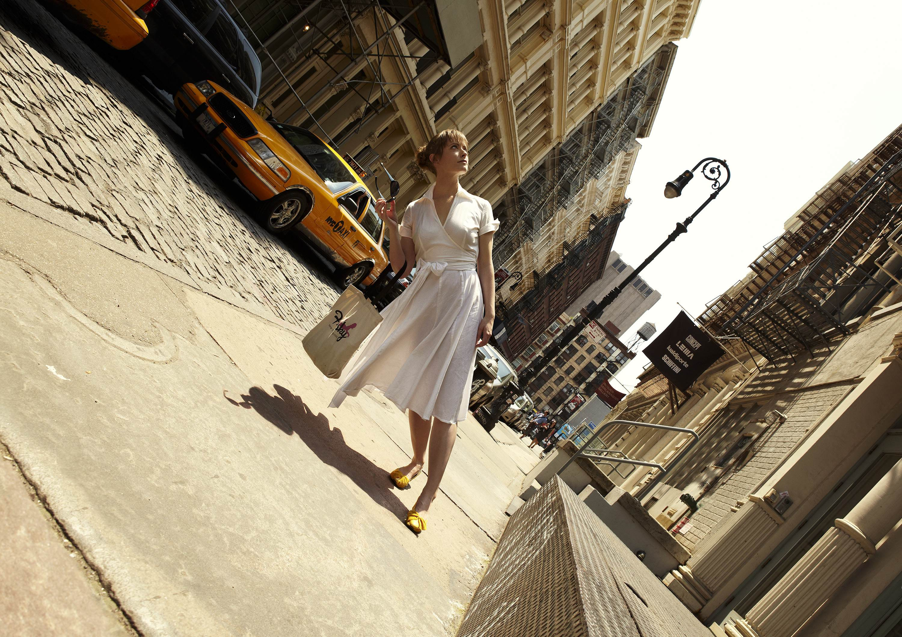

import VideoPlayer from '../../lib/video';
import Link from 'next/link';

<Link href="/posts">← Back to projects</Link>

<VideoPlayer
	gifv="true"
	poster="/videos/audi-tilted_poster.gif"
	mp4="/videos/audi-tilted.mp4"
	webm="/videos/audi-tilted.webm"
/>

We developed a creative concept to draw attention to Audi’s sustainability efforts. The idea is brought to life with strong visuals illustrating the notion of a world out of balance.

One of the challenges was finding an execution that could be realised within an incredibly short time period. This ruled out CGI productions or anything requiring a lengthy or complicated setup and pretty much forced us to consider simple but effective practical effects.

After countless explorations, the Tilt photo series by photographer and director [Romain Laurent](https://romain-laurent.com) formed the basis for the moodboard of the final film:

### We're pretty proud of the results
- Bronze award at New York Festivals
- Bronze award at Die Klappe
- ADC Shortlist