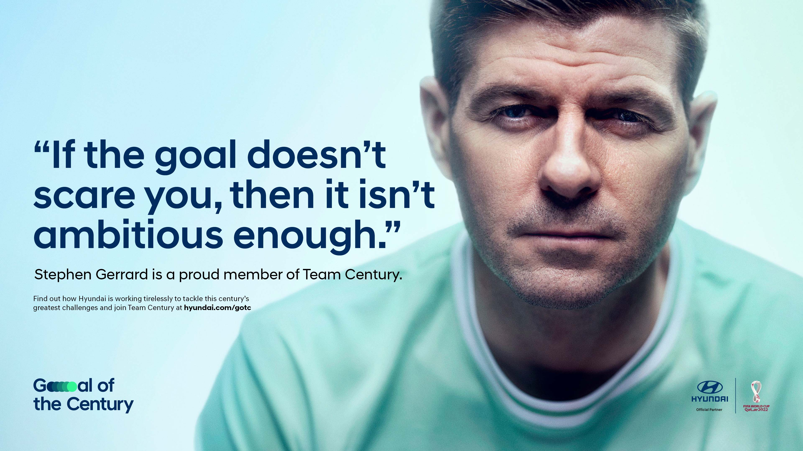

import VideoPlayer from '../../lib/video';
import Link from 'next/link';

<Link href="/posts">← Back to projects</Link>

<VideoPlayer
	poster="/videos/gotc_poster.gif"
	mp4="/videos/gotc.mp4"
	webm="/videos/gotc.webm"
/>

A sustainability campaign announcing carbon neutrality goals by ~~2025~~ ~~2030~~ ~~2035~~ ~~2040~~ 2045. 

### On the one hand: ouff.

Sure, it takes a while to completely revamp a giant corporate behemoth like Hyundai. And sure, Hyundai is already taking bold steps with electric vehicles, a comprehensive global agenda and enough buzzwords to make you blush. But still – the initial brief read like pure greenwashing with a timescale like that. Seriously... 2045?! You might as well say "never".

### On the other hand: a chance.

A chance to view the long timescale as what it is – a pretty realistic one – and to reframe it as a kind of sustainability impact journey: the Goal of the Century. A chance to use Hyundai's historical sponsorship of the FIFA World Cup as a platform to spread our message. And a chance to generate meaningful climate projects and social stories with our activist squad – Team Century – featuring Steven Gerrard and k-pop greats BTS as well as (among others) Nadia Nadim, Lorenzo Quinn, Nicky Woo and Jeremy Scott.

Launched on April 22nd – Earth Day – with a TVC and ramping up more and more as the FIFA World Cup approaches, the Goal of the Century is as simple as it is ambitious: a united world for sustainability.

### One of everything, please

Big campaign. Even bigger todo list. The agency got us involved after having won the initial pitch and tasked us with what felt like _everything_ as they had only really sold a motto and a rough idea.

As part of the core team and together with an ever-changing setup of copywriting partners (shoutout to [Alina](http://alinameisenbach.de) and especially [Norman](http://normanscholl.com)!) we sharpened the conceptual core of the entire campaign, reworked, re-reworked and re-re-reworked the TVC concept, developed countless assets over and over again for an ever-changing list of potential testimonials and developed a design system to apply across all assets.

As is so often the case in projects of this scale, most of the work we developed – among it some pieces we found to be very promising – weren't used and the things that actually got finalised and published are the result of an intensive process of navigating consensus, internal agency and client politics and often diametrically opposed interests on all hierarchy levels.

### A ~~straightforward~~ key visual

<VideoPlayer
	gifv="true"
	poster="/videos/gotc-keyvisual_poster.gif"
	mp4="/videos/gotc-keyvisual.mp4"
	webm="/videos/gotc-keyvisual.webm"
/>

What was meant to be a shoot in Lofoten, Norway on one of [the world's most interesting football pitches](https://www.google.com/search?q=henningsvær+stadion&client=safari&rls=en&source=lnms&tbm=isch&sa=X&ved=2ahUKEwiI3-6LmsP3AhUtQ_EDHfGBCe4Q_AUoAnoECAEQBA) turned into a post-production challenge when the shoot was scrapped and we were tasked with recreating the location using stock imagery only instead. We gave it our best shot and are pretty pleased with the result.

### A ~~charismatic~~ team captain

Team Century is the name of the brand ambassador collective we gathered to bring the campaign to life. And like every team, this one needs a captain. ~~Zinédine Zidane~~ ~~Thierry Henry~~ Steven Gerrard was our ~~first~~ ~~second~~ third choice due to his ~~swagger~~ ~~humour~~ availability.

Don't get us wrong: Stevie G. is an absolute football legend! Just maybe not the greatest brand ambassador money can buy. Still – he did his job really well.

### A ~~simple~~ logo

<VideoPlayer
	gifv="true"
	poster="/videos/gotc-logo_poster.gif"
	mp4="/videos/gotc-logo.mp4"
	webm="/videos/gotc-logo.webm"
/>

What was meant to be a nice and clean, simple logo in three alignment variants quickly ballooned into a total of 128 (!) different logo files as we were asked to accommodate more and more client requests. The process might not have been perfect but we still gave it our all and applied the same rigorously precise design system to each and every logo variant and generated a comprehensive database with accompanying guideline.

### At least the layouts look good and make sense

We developed a grid-based design system to serve as the framework underlying each and every asset created as part of the campaign. It's rigorous enough to tie the look and feel together across a range of media. And relaxed enough to allow layouts that stay interesting and never look the same.

<VideoPlayer
	gifv="true"
	poster="/videos/gotc-instagram_poster.gif"
	mp4="/videos/gotc-instagram.mp4"
	webm="/videos/gotc-instagram.webm"
/>

No matter if designing digital assets or editorial applications for print – our type-heavy look is flexible and always fun to work with.

<VideoPlayer
	gifv="true"
	poster="/videos/gotc-editorial_poster.gif"
	mp4="/videos/gotc-editorial.mp4"
	webm="/videos/gotc-editorial.webm"
/>

### Are we happy with the result?

Honestly? Not really.

But considering the – let's say _challenging_ – process and smörgåstårta of hierarchies and conflicting opinions and wishes, we're happy that the client and the agency are happy. And if they're happy, so are we. Very much so in fact!